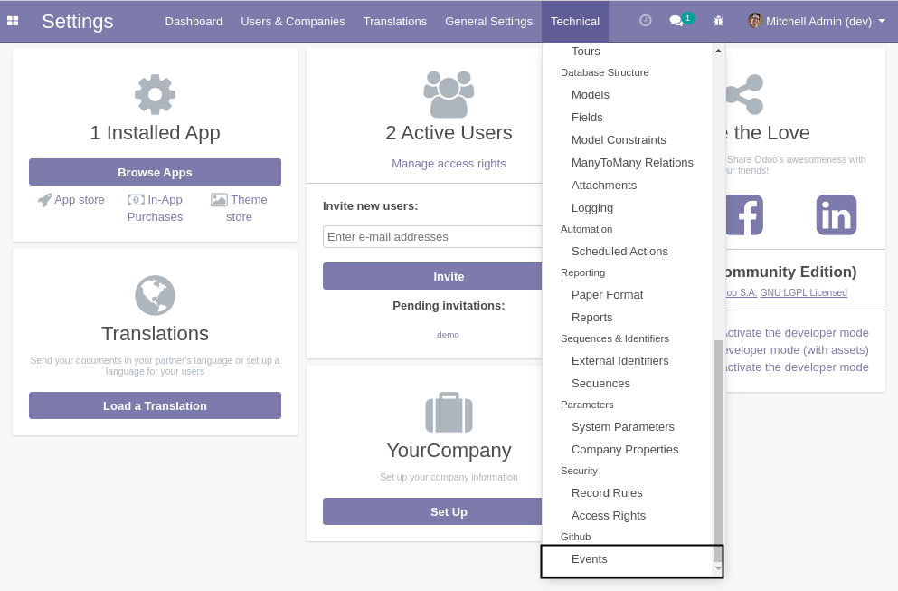
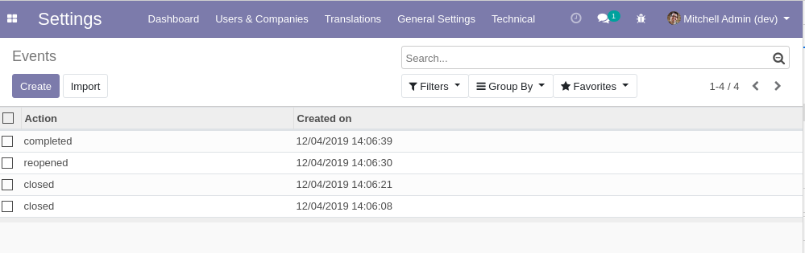
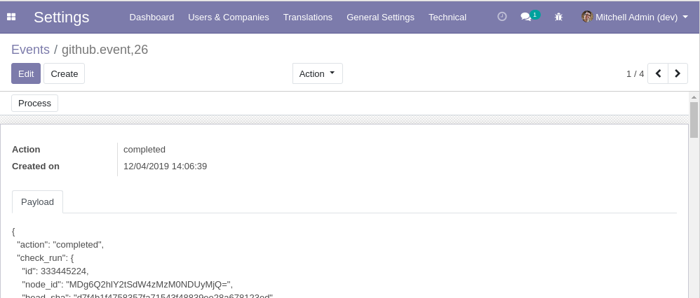
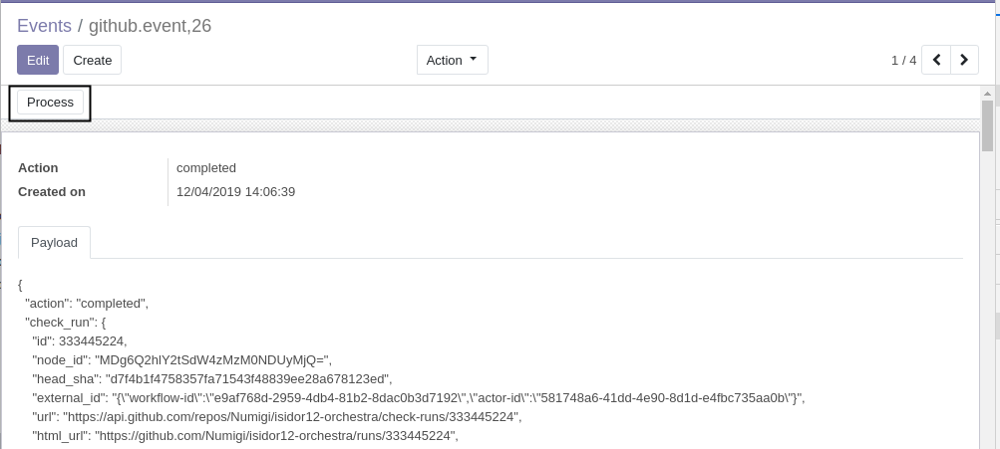

Github Events
=============

This modules defines what is a GitHub event (as an Odoo object).

.. contents:: Table of Contents

Events
------
As system administrator, I go to ``Configuration > Technical > GitHub > Events``.

I see the list of events:

I open the form view of an event.

Process Button
--------------
The ``Process`` button in the form view of events triggers the parsing of the payload.

When no extra module is installed, only the ``Action`` is filled.

Clicking multiple times on the button is idempotent.

Contributors
------------
* Numigi (tm) and all its contributors (https://bit.ly/numigiens)
