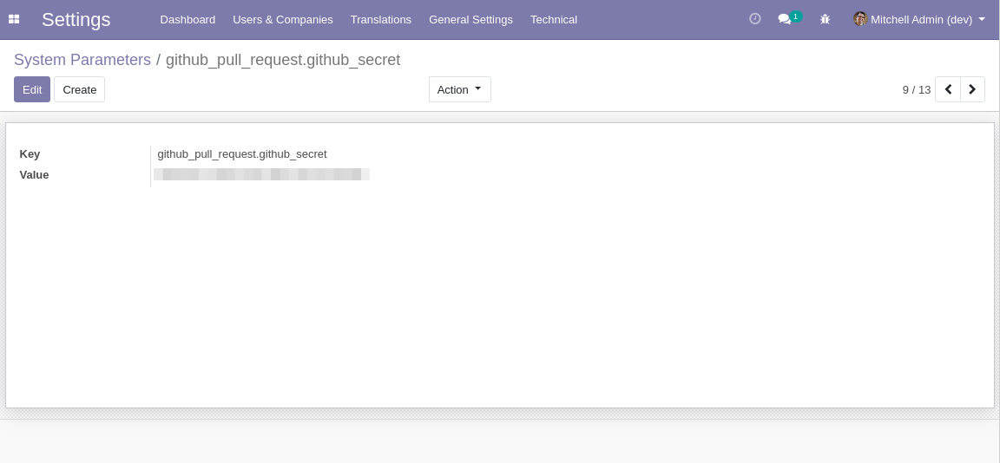
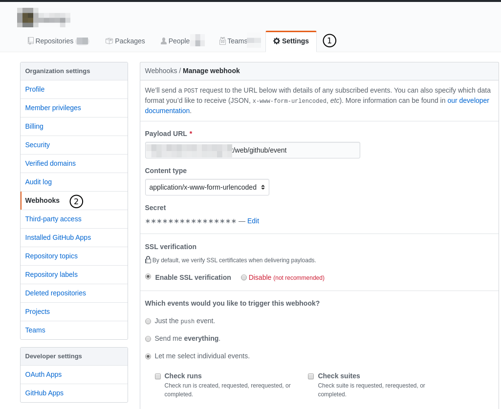

Github Event Webhook
====================
This module defines an HTTP controller to register events in Odoo using github webhook.

Each event is processed asynchronously in a queue job.

.. contents:: Table of Contents

Configuration
-------------

Define your Secret
~~~~~~~~~~~~~~~~~~
First, generate a secret that will be used to authentify the webhook with your Odoo instance.
You may use the tool of your choice to create the secret.

Then, create a system parameter:

* Key: ``github_pull_request.github_secret``
* Value: Your secret

Setup the Webhook
~~~~~~~~~~~~~~~~~
Then, in Github, setup the webhook.

* Payload URL: ``{base_url}/web/github/event``
* Content Type: ``application/x-www-form-urlencoded``
* Secret: Your secret

In the section ``Which events would you like to trigger this webhook?``,
select ``Let me select individual events``, then check ``Pull requests``.

Contributors
------------
* Numigi (tm) and all its contributors (https://bit.ly/numigiens)
