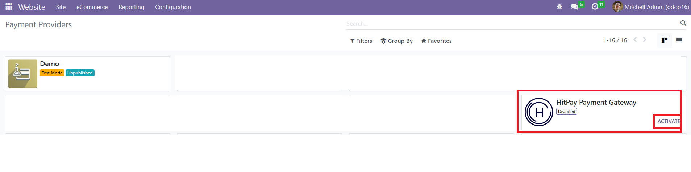

.. image:: images/logo.png

===================================================
HitPay Payment Gateway for Odoo E-commerce
===================================================

HitPay Payment Gateway for Odoo E-commerce is an open source module that links Odoo based e-commerce websites to HitPay Payment Gateway developed by https://www.hitpayapp.com/

Installation & Upgrade
======================

Download the latest module archive from https://github.com/hit-pay/odoo-extension/releases.

Now unzip the downloaded archive and copy the new payment_hitpay folder to Odoo addons directory. 

* [ODOO_ROOT_FOLDER]/server/odoo/addons/
* /var/lib/odoo/addons/[VERSION]/ (on Linux only)
* `addons_path` defined in odoo.conf

Then, youcan choose  one of these instructions:

* In your Odoo administrator interface, browse to "Configuration" tab. Here in, activate the developer mode.
* Or restart Odoo server with *sudo systemctl restart odoo* on Linux or by restarting Windows Odoo service.
  Odoo will update the applications list on startup.
*  Then browse to "Applications" tab and click on "Update applications list".

In your Odoo administrator interface, browse to "Applications" tab, delete "Applications" filter from
search field and search for "hitpay" keyword. Click "Install" (or "Upgrade") button of the "HitPay Payment Gateway Provider" module.

Configuration
=============

* Go to "Website Admin" tab

* In "Configuration" section, expand "eCommerce" menu than click on "Payment Providers" entry

* Select HitPay Payment Gateway module

* You can now enter your HitPay Payment Gateway credentials

IMPORTANT
---------
* You should select a Payment Journal in the "Configuration" tab of the HitPay Payment Gateway
  to start using this payment method.
  
Checkout
=============
.. image:: images/9-Frontend-Checkout-Page-Choose-Hitpay.png

Payment Confirmation
--------------------

Sales Order
===========
Navigate to eCommerce Orders => Orders

Payment Transaction Details
===========================
Navigate to Configuration => eCommerce => Payment Transactions

.. image:: images/13-Payment-Transaction-Details.png

Refunds
===========================
* In the payment transaction, click the payment link eg: PBNK1/2023/00004
* You see the below screen and click the 'Refund' button and enter the amount to refund.

Change Log
==========
1.0.
--------------------
* Initial release.
